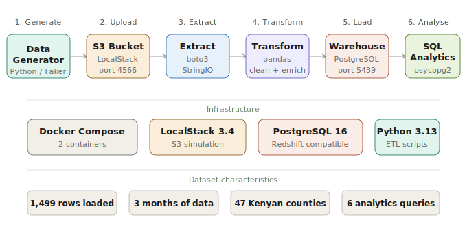

# Cloud Batch Pipeline

A cloud batch data pipeline that simulates AWS infrastructure locally using LocalStack and Docker. Raw Kenyan retail sales data flows from CSV generation through S3 object storage, a Python ETL layer, and into a PostgreSQL data warehouse where it is queried with SQL analytics.

---

## Architecture



---

## Tech Stack

| Layer | Technology |
|---|---|
| Cloud simulation | LocalStack 3.4 |
| Object storage | AWS S3 (simulated via LocalStack) |
| Data warehouse | PostgreSQL 16 (Redshift-compatible) |
| ETL processing | Python 3.13, pandas, boto3 |
| Database driver | psycopg2 |
| Data generation | Faker |
| Containerisation | Docker, Docker Compose |
| Logging | Python standard logging module |

---

## Project Structure

```
cloud-batch-pipeline/
├── docker-compose.yml          LocalStack (S3) and PostgreSQL warehouse containers
├── pipeline.py                 Master orchestration script: runs all steps end to end
├── requirements.txt            Python dependencies
├── .env.example                Environment variable template
├── docs/
│   └── architecture.svg        Pipeline architecture diagram
├── data/
│   └── generate_data.py        Generates synthetic Kenyan retail sales CSV files
├── etl/
│   ├── upload_to_s3.py         Creates S3 bucket and uploads CSV files
│   ├── extract_from_s3.py      Downloads CSV files from S3 into memory as DataFrames
│   ├── transform.py            Cleans, validates, and enriches the raw data
│   └── load_to_redshift.py     Creates warehouse table and bulk-inserts cleaned data
└── analytics/
    └── queries.py              Six SQL analytics queries with formatted terminal output
```

---

## Pipeline Steps

| Step | Script | Description |
|---|---|---|
| 1. Generate | `data/generate_data.py` | Creates 1,500 synthetic sales transactions across Jan, Feb, Mar 2026 with realistic Kenyan shop names, counties, and M-Pesa references |
| 2. Upload | `etl/upload_to_s3.py` | Creates `kenya-sales-bucket` in LocalStack S3 and uploads three monthly CSV files to the `raw/` prefix |
| 3. Extract | `etl/extract_from_s3.py` | Lists all CSVs in the S3 `raw/` prefix, downloads each directly into memory using `StringIO`, and combines into one DataFrame |
| 4. Transform | `etl/transform.py` | Removes duplicate transaction IDs, fixes data types, fills null M-Pesa references, and adds nine derived columns |
| 5. Load | `etl/load_to_redshift.py` | Creates the `sales` table if it does not exist and bulk-inserts all records using `execute_values` in batches of 100 |
| 6. Analytics | `analytics/queries.py` | Runs six SQL queries covering monthly revenue, top counties, product categories, payment methods, shops, and revenue bands |

---

## Dataset

| Property | Value |
|---|---|
| Source rows | 1,500 (500 per month) |
| Rows after deduplication | 1,499 |
| Months covered | January, February, March 2026 |
| Kenyan counties | 47 (all counties represented) |
| Retail shops | 40 (supermarkets, pharmacies, online stores) |
| Product categories | Electronics, Clothing, Food and Beverage, Household, Mobile Phones, Furniture, Cosmetics, Stationery |
| Payment methods | M-Pesa, Cash, Card, Bank Transfer |

---

## Transform: Cleaning and Enrichment

**Cleaning applied:**

| Issue | Fix |
|---|---|
| Duplicate `transaction_id` rows | Removed with `drop_duplicates()` |
| `transaction_date` stored as string | Converted to datetime with `pd.to_datetime()` |
| Null `mpesa_ref` for non-M-Pesa payments | Filled with `"N/A"` |
| Numeric columns with floating point noise | Rounded to 2 decimal places |

**Derived columns added:**

| Column | Description |
|---|---|
| `year` | Year extracted from transaction date |
| `month` | Month number (1, 2, 3) |
| `month_name` | Month name (January, February, March) |
| `hour_of_day` | Hour of transaction (0 to 23) |
| `day_of_week` | Day name (Monday through Sunday) |
| `is_weekend` | True if Saturday or Sunday |
| `is_mpesa` | True if payment method is M-Pesa |
| `revenue_band` | Low under KES 1K, Medium 1K to 10K, High 10K to 50K, Premium above 50K |

---

## Analytics Results

**Monthly Revenue**

| Month | Transactions | Revenue (KES) |
|---|---|---|
| January | 499 | 36,028,265 |
| February | 500 | 38,360,223 |
| March | 500 | 37,264,844 |
| **Total** | **1,499** | **111,653,332** |

**Top 5 Counties by Revenue**

| County | Transactions | Revenue (KES) |
|---|---|---|
| Homa Bay | 44 | 3,508,967 |
| Embu | 39 | 3,073,052 |
| Bomet | 39 | 2,962,379 |
| Kilifi | 37 | 2,848,791 |
| Isiolo | 37 | 2,802,275 |

**Payment Method Split**

| Method | Transactions | Share |
|---|---|---|
| Bank Transfer | 402 | 26.82% |
| Cash | 367 | 24.48% |
| Card | 365 | 24.35% |
| M-Pesa | 365 | 24.35% |

**Revenue Band Distribution:** 65.44% of all revenue (KES 98.6M) comes from Premium transactions above KES 50,000.

---

## Getting Started

### Prerequisites

- Docker Desktop (running)
- Python 3.13
- Git

### 1. Clone the repository

```bash
git clone https://github.com/Brian-10-star/cloud-batch-pipeline.git
cd cloud-batch-pipeline
```

### 2. Set up environment variables

```bash
cp .env.example .env
```

The default values in `.env.example` work out of the box with LocalStack. No AWS account needed.

### 3. Install Python dependencies

```bash
pip install -r requirements.txt
```

### 4. Start Docker services

```bash
docker-compose up -d
```

This starts two containers: LocalStack on port 4566 (S3) and PostgreSQL on port 5439 (data warehouse).

### 5. Run the full pipeline

```bash
python pipeline.py
```

All six steps run in sequence with structured log output. Total runtime is approximately 3 to 5 seconds.

### 6. Run analytics only

After the pipeline has loaded data at least once, you can re-run just the queries:

```bash
python analytics/queries.py
```

### 7. Stop Docker services

```bash
docker-compose down
```

---

## Environment Variables

| Variable | Description | Default |
|---|---|---|
| `AWS_ACCESS_KEY_ID` | Fake AWS key for LocalStack | `test` |
| `AWS_SECRET_ACCESS_KEY` | Fake AWS secret for LocalStack | `test` |
| `AWS_DEFAULT_REGION` | AWS region | `us-east-1` |
| `AWS_ENDPOINT_URL` | LocalStack endpoint | `http://localhost:4566` |
| `S3_BUCKET_NAME` | S3 bucket name | `kenya-sales-bucket` |
| `REDSHIFT_HOST` | Warehouse host | `localhost` |
| `REDSHIFT_PORT` | Warehouse port | `5439` |
| `REDSHIFT_DB` | Database name | `salesdb` |
| `REDSHIFT_USER` | Database user | `admin` |
| `REDSHIFT_PASSWORD` | Database password | set in `.env` |

---

## Key Engineering Decisions

**LocalStack for S3, PostgreSQL for the warehouse.** LocalStack Community edition provides a fully functional S3 simulation. For the warehouse layer, a dedicated PostgreSQL 16 container is used because it provides a real connectable database over the standard wire protocol. AWS Redshift is itself PostgreSQL-compatible, so all SQL written here runs identically on real Redshift.

**Idempotent load with `ON CONFLICT DO NOTHING`.** The pipeline can be run multiple times without errors. If a `transaction_id` already exists in the warehouse, the duplicate insert is silently skipped rather than raising a constraint violation.

**Batch inserts with `execute_values`.** All 1,499 rows are sent to the database in batches of 100 using `psycopg2.extras.execute_values`. This reduces network round-trips from 1,499 to 15, making the load step significantly faster.

**In-memory extraction.** CSV files are downloaded from S3 directly into memory using `StringIO`. No intermediate files are written to disk between the extract and transform steps, which is how production cloud ETL pipelines operate.

**Structured logging throughout.** Every script uses Python's built-in `logging` module with a consistent format showing timestamp, level, module name, and message. This makes it straightforward to trace any issue back to the exact step and script that caused it.

---

## Author

Brian Mbugua Chira
BSc Computer Science, Egerton University
[github.com/Brian-10-star](https://github.com/Brian-10-star)